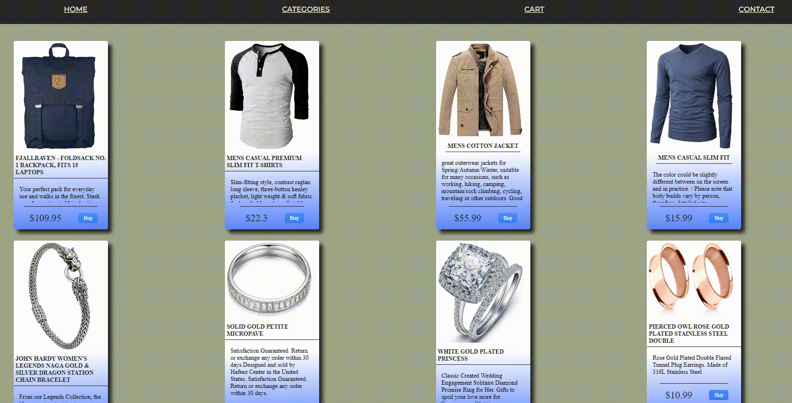

# React Shop
REACTSHOP is basic e-commerce website.  
This shopping website can by easy tailored for any database to render required products. In this version I fetch data from https://fakestoreapi.com/ 
I implemented many reusable react component to build this shop and make this application perfect for extending to bigger e-commerce.


## Tool & technologies I've used

- React
- TypeScript
- Fake Store API
- Styled Components

## App functionalities

Thanks to hook useContext data retrieved from API or database can be pass very easy thought application. 
Shop contain four main functionalities, home page with fetching all products, when click on image render single prodact page with full description, categories page where listed all categories, cart with complex shop basket actions and contact page with simple contact form used Formik.  
 


## How to use it

```
Use command git clone https://github.com/michalsamulak/ReactShop.git

Use `npm install` command to get all required dependencies.
```

  


I hope you enjoy this app

### I built this program thanks to knowledge what I learn from fundamentals at [Localhoste Academy](https://academy.localhost-group.com/)


# 
